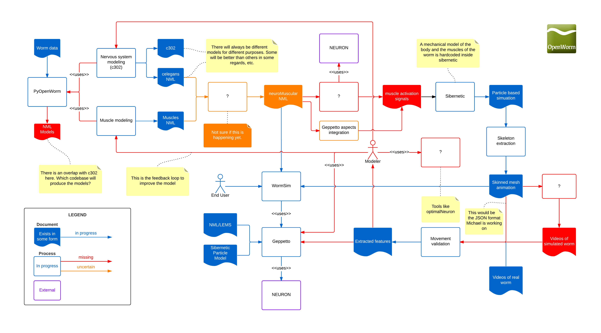

OpenWorm Projects
=================

The project is currently laid out into seven major areas shown below:

-   Neuromechanical modeling with Sibernetic
-   Geppetto Simulation Engine
-   Movement validation
-   Optimization engine
-   Data collection and representation
-   Community outreach
-   Muscle-Neuron integration

**NeuroMechanical Modeling - Sibernetic**

While our ultimate goal is to simulate every cell in *C. elegans*, we are starting out by building a model of its body, its nervous system, and its environment. [Sibernetic](http://sibernetic.org) is the home of the C++ code base that implements the core of the model. We have implemented an algorithm called Smoothed Particle Hydrodynamics (SPH) to simulate the body of the worm and its environment using GPUs. This algorithm has been initially worked out in C++ (with OpenGL visualization).

To get a quick idea of what this looks like, check out the [latest movie](https://www.youtube.com/watch?v=SaovWiZJUWY). In this movie you can see a simulated 3D *C. elegans* being activated in an environment. Its muscles are located around the outside of its body, and as they contract, they exert forces on the surrounding fluid, propelling the body forward via undulutory thrust. In this model, the neural system is not considered and patterns of muscle contraction are explicitly defined.

More detailed information is available on the [Sibernetic project page](sibernetic/).

**Geppetto Simulation Engine**

In order to allow the world to play with the model easily, we are engineering [Geppetto](http://geppetto.org), an open-source modular platform to enable multi-scale and multi-algorithm interactive simulation of biological systems. Geppetto features a built-in WebGL visualizer that offers out-of-the-box visualization of simulated models right in the browser. You can read about architectural concepts and learn more about the different plug-in bundles we are working on.

More detailed information is available on the [Geppetto project page](geppetto/).

**Movement validation**

In order to know that we are making meaningful scientific progress, we need to validate the model using information from real worms. The movement validation project is working with an existing database of worm movement to make the critical comparisons.

The main goal of the Movement Validation team is to finish a test pipeline so the OpenWorm project can run a behavioural phenotyping of its virtual worm, using the same statistical tests the Schafer lab used on their real worm data.

More detailed information is available on the [Movement validation project page](worm-movement/).

**Optimization engine**

The Optimization engine uses optimization techniques like genetic algorithms to help fill gaps in our knowledge of the electrophysiology of *C. elegans* muscle cells and neurons.

More detailed information is available on the [Optimization project page](optimization/).

**Data Collection and Representation**

A lot of data about *C. elegans* is integrated into the model. In this project, we work on what forms we should put these data in to best leverage them for building the model.

More detailed information is available on the [Data representation project page](datarep/).

**Community Outreach**

The effort to build the OpenWorm open science community is always ongoing.

More detailed information is available on the [Community project page](community-proj/).

**Muscle-Neuron Integration**

The goal of this project is to underpin our muscle and neuron models with biological data. This will be accomplished by creating biologically-realistic ion channel models from experimental data, which will then give rise to neural dynamics.

More detailed information is available on the [Muscle-Neuron integration project page](muscle-neuron-integration/).
